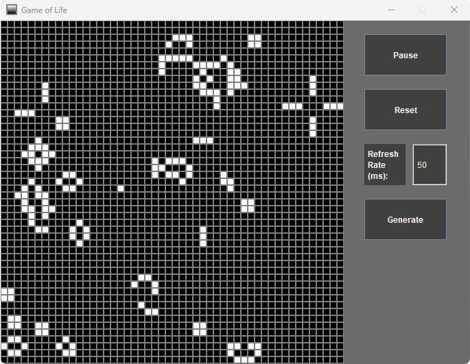

# Game of Life (Java implementation)

This was my project in the second year of high school. It focused on implementing Conway's Game of Life in Java.

## Features

* Click on a cell to change its state
* Pause/resume
* Reset the grid
* Change the refresh rate (time between generations)
* Generate a random grid of living/dead cells

## Rules

- Any living cell with fewer than two live neighbors dies
- Any living cell with two or three live neighbors lives on
- Any living cell with more than three live neighbors dies
- Any dead cell with exactly three live neighbors becomes a living cell

## Screenshot

